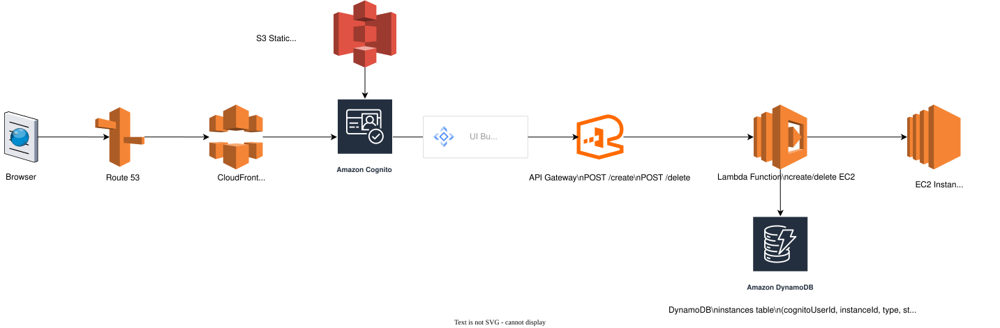

# AWS Serverless EC2 Control

<p align="center">
  
</p>

<p align="center"></p>

Serverless reference implementation using:
- Terraform for infrastructure
- Lambda + API Gateway HTTP API for backend
- Cognito Hosted UI for authentication
- DynamoDB for tracking EC2 instances per user
- S3 + CloudFront for hosting the frontend

The frontend lets an authenticated user:
- Create an EC2 instance
- Delete all of their own instances (looked up from DynamoDB)

---

## 1. Deploy Infrastructure with Terraform

All IaC lives under the `terraform` directory.

From the repo root:

```bash
cd terraform

# First-time setup
terraform init

# Review changes
terraform plan

# Apply changes
terraform apply
```

Terraform creates (among other things):
- Cognito User Pool + App Client + Hosted UI
- Lambda `login-redirect` (handles login/logout + EC2 create/delete)
- HTTP API Gateway
- DynamoDB table `InstanceManagementTable`
- S3 bucket for the frontend (name from `var.s3bucketname`)
- CloudFront distribution in front of the S3 bucket

After apply, you can retrieve the API base URL with:

```bash
cd terraform
terraform output api_base_url
```

Copy this value; you will use it in the frontend.

---

## 2. Configure the Frontend (API URL)

Frontend entry point is [frontend/index.html](frontend/index.html).

Near the top of the script block you will see:

```js
const API_BASE = 'https://your-api-id.execute-api.us-east-1.amazonaws.com';
```

Update this line so that `API_BASE` matches the value from `terraform output api_base_url`, for example:

```js
const API_BASE = 'https://abcd1234.execute-api.us-east-1.amazonaws.com';
```

Save the file after editing.

---

## 3. Upload `index.html` to the S3 Bucket

Terraform creates the frontend S3 bucket using the `s3bucketname` variable defined in [terraform/variables.tf](terraform/variables.tf). The default in this repo is `froneendtwebsite2026`.

To upload the updated `index.html`:

```bash
# From the repo root
aws s3 cp frontend/index.html s3://froneendtwebsite2026/index.html --region us-east-1
```

If you changed `s3bucketname`, replace `froneendtwebsite2026` with your actual bucket name.

CloudFront is already configured to serve `index.html` as the default root object for your domain (from `local.my_domain` in [terraform/locals.tf](terraform/locals.tf)). After upload, invalidate CloudFront if you still see an old version:

```bash
aws cloudfront create-invalidation \
  --distribution-id <YOUR_DISTRIBUTION_ID> \
  --paths /index.html
```

---

## 4. Using the App

1. Browse to your CloudFront domain (for example, `https://sajil.click/`).
2. Click **Login** and complete the Cognito Hosted UI flow.
3. After redirect back, click **Create EC2 Instance**.
4. When you are done, click **Delete My Instances** to terminate all EC2 instances associated with your Cognito user and remove their records from DynamoDB.

---

## 5. Notes & Safety

- EC2 instances incur cost while running; ensure you delete them when finished.
- Terraform state files can contain identifiers and configuration; prefer a remote backend (S3 + DynamoDB) for production.
- IAM policies are intentionally broad for learning; tighten them before using in a real environment.

## 6. Release Strategy & CI/CD

### Terragrunt Dev Workflow

The repository includes a GitHub Actions workflow for applying the dev
environment with Terragrunt and temporary S3 remote state:

```text
.github/workflows/terragrunt-dev.yml
```

The workflow can be run manually from GitHub Actions:

```text
Actions -> Terragrunt Dev Apply -> Run workflow
```

Choose:

- `plan` to review changes.
- `apply` to bootstrap S3 state and apply the dev environment.

On pushes to `main`, the workflow also runs automatically when Terraform,
backend code, the buildspec, the Terragrunt wrapper script, or the workflow file
changes.

Required GitHub Actions secret:

```text
AWS_GITHUB_ACTIONS_ROLE_ARN
```

This must be the IAM role ARN that GitHub Actions can assume through OIDC.

Optional GitHub Actions variable:

```text
TG_STATE_BUCKET
```

If omitted, the workflow uses:

```text
sajilpb-aws-serverless-arch-tfstate-test
```

The workflow uses S3 state only for the Actions run by setting:

```bash
TG_REMOTE_STATE_BACKEND=s3
```

The default local Terragrunt state remains available for local testing. The S3
backend is bootstrapped automatically before `plan` or `apply`:

```bash
terragrunt backend bootstrap --non-interactive
terragrunt init -migrate-state -force-copy
```

### Branching Strategy

This project uses a **three-branch model** for controlled deployments:

#### `dev` Branch
- **Purpose:** Development and testing environment
- **Trigger:** Automatic CI/CD on push to `dev`
- **Deployment:** 
  - Backend changes (`Backend/**`) → Upload to S3 Dev bucket
  - Terraform changes (`terraform/**`) → Apply to Dev environment
- **Workflow Files:**
  - `.github/workflows/Lambda-CI-Dev.yml` (code deployment)
  - `.github/workflows/Terraform-Dev.yml` (infrastructure deployment)

#### `release/*` Branch
- **Purpose:** Release staging and final validation
- **Creation:** Create from `dev` when ready to release (e.g., `release/1.0.1`)
- **Deployment:** Optional extra validation/testing workflows
- **Next Step:** Open Pull Request into `main`

#### `main` Branch
- **Purpose:** Production environment
- **Trigger:** Automatic CI/CD on merge (via PR) or push to `main`
- **Deployment:** 
  - Backend changes → Upload to S3 Prod bucket
  - Terraform changes → Apply to Prod environment
- **Workflow Files:**
  - `.github/workflows/Lambda-CI-Prod.yml` (code deployment)
  - `.github/workflows/Terraform-Prod.yml` (infrastructure deployment)

### Release Workflow
